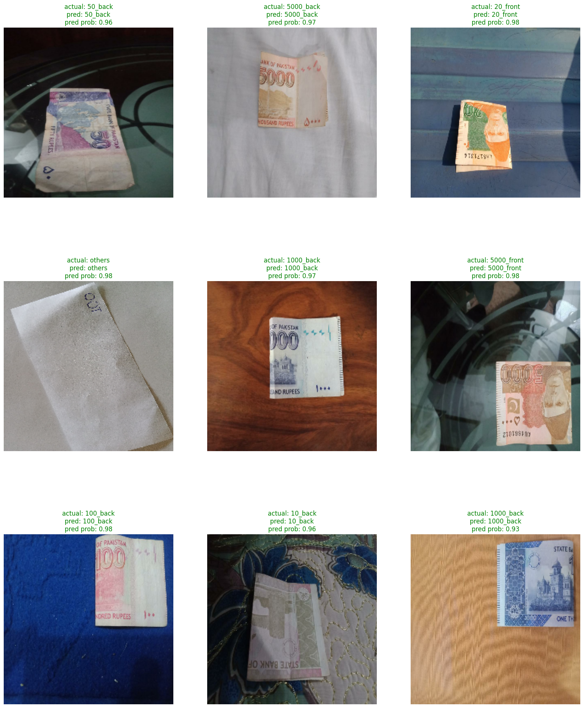

# Pakistani Currency Detector

## Introduction
This project is about detecting Pakistani currency notes using Deep Learning. The model is trained on 15 Classes i.e 10, 20, 50, 100, 500, 1000, 5000 further divided into front and back side of the note. The model is trained on about 240 images of each class.

## Dataset
The dataset used for training the model is created by me. The dataset is available on [Kaggle](https://www.kaggle.com/datasets/rafayqayyum/pakistan-image-currency-dataset). The dataset contains 14 classes of currency notes i.e 10, 20, 50, 100, 500, 1000, 5000 further divided into front and back side of the note with others class which contains images of other objects. The dataset contains about 240 images of each class.

## Model
The models used are as follows:
- MobileNetV3Small
- EfficientNetV2B0

## Results

### MobileNetV3Small
MobileNetV3Small achieved an F1-score of 99% on the test set.



### EfficientNetV2B0
EfficientNetV2B0 achieved an F1-score of 100% on the test set.


## Training
The model is trained on Google Colab. The training notebook is available in the repository.

## Usage
There are two ways to use the model:
- Using Live Camera
- Through Streamlit Web App

### Using Live Camera

To use the model using live camera, run the following command:
```
python currency_detect_live.py
```

### Through Streamlit Web App
To use the model through streamlit web app, run the following command:
```
streamlit run app.py
```

